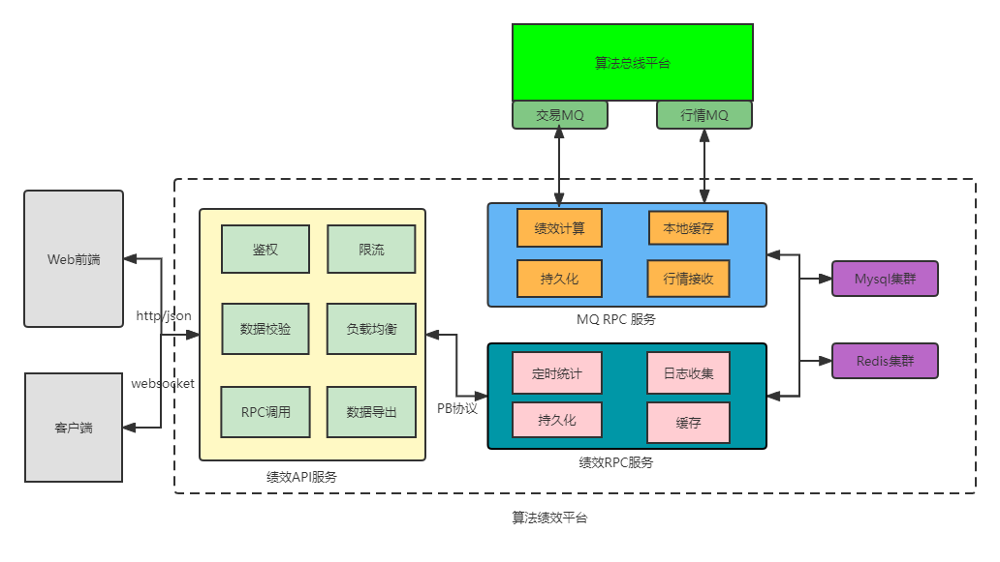

##系统架构图

算法绩效平台go-zero实现，按功能划分，目前分为四个服务框架：

assess-api-server: 绩效api服务，负责接收前端请求，作鉴权和数据校验，rpc服务调用等功能, 分配端口号8088

assess-rpc-server: 绩效rpc服务，负责后台数据DB，缓存的修改和维护等功能，分配端口号 6080

asssess-mq-server: 绩效mq服务，负责读取mq数据，作处理后落地DB，缓存， 分配端口号 5080

market-mq-server: 行情mq服务， 负责从kafka 读取行情数据， 然后推送到 assess-mq-server服务，分配端口号 7080

####目录说明：

1.后缀带server的文件为可编译运行的服务模块，命名规则为xxx-xxx-server

2.build：部署脚本，项目创建命令等

3.client: 客户端调试工具

4.doc: 项目文档

5.global: 全局变量定义，错误码定义等

6.models: 数据库表字段映射struct文件，文件名与表名保持一致

7.pkg: 通用工具包，供内部所有服务调用

8.repo:数据库增删改查相关操作

9.script: 数据库建表脚本